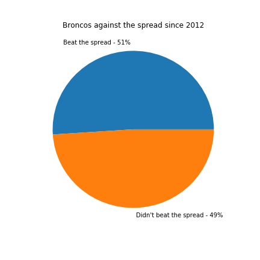
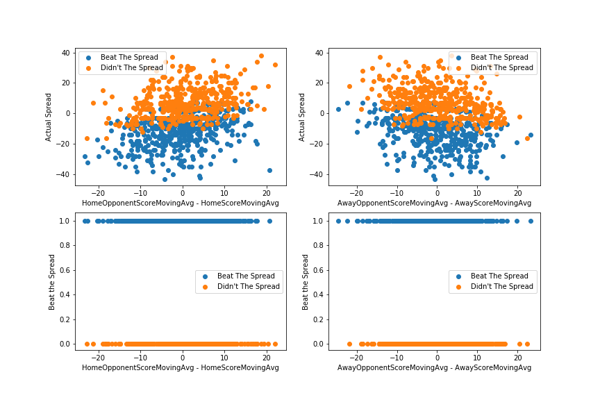
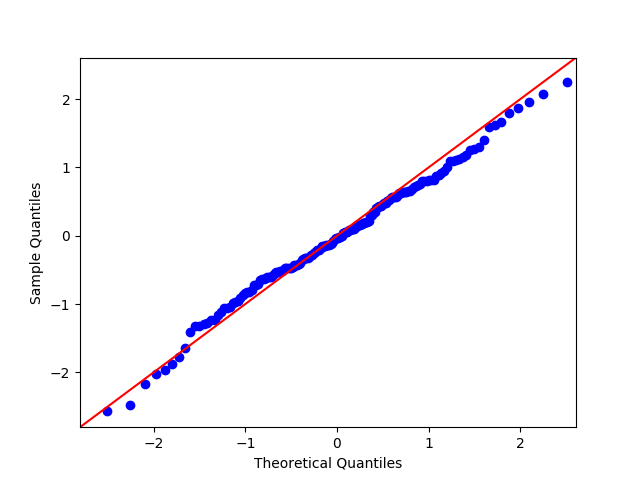

# Betting the Spread

### Background
Growing up in Denver, I religiously watched the Broncos with my dad every Sunday. Throughout my years as a Bronco fan, there have been a lot of ups and downs - namely Super Bowl 48 and Super 50 - but if one thing has stayed consistent, it is my dad yelling at the tv that the Broncos never beat the spread.

##### Spread Definition
A point spread in sports is a figure set by oddsmakers to provide an advantage or disadvantage based on the margin of victory or defeat for a given team. The “favorite” team (labeled with a “-” sign) would be at the disadvantage as they would need to win the game by a set number of points while the “underdog” team (labeled with a “+” sign) would be given an advantage to not lose the game by a set number of points. The reason oddsmakers do this is to provide betting interest for both sides due to one team typically being better than the other.

For Example:


As you can see, the Rams are a 7-point favorite which means they would need to win the game by more than 7 points to cover the spread. Conversely, the Broncos are a 7-point underdog which means they would need to win or not lose the game by more than 7 points to cover the spread. If LA wins 20-17, then they win by three points and did NOT cover the 7 points, but Denver has “covered the spread” because they stayed within 7 points.

##### Broncos Historically Against the Spread


Even though the Broncos never seemingly beat the spread, since 2012, the Broncos have covered the spread in 51% of the games they played. But if I had to guess whether or not the Broncos cover the spread this weekend against the undefeated Los Angles Rams, I would bet that they don't because the Broncos never beat the spread.


My dad's faithful criticism of the Broncos inspired me to try and build a model to predict whether an NFL team beat the spread or not. For the scope of the project, I am only looking at Regular Season NFL Games from 2012 to 2018.


### The Data

<!-- https://developer.fantasydata.com/docs/services/57a0190935491a1858749954/operations/58137f1c35491a1520575141/console -->
<!-- http://www.vegasinsider.com -->

The game data for this project came from the Fantasy Data API, which had 242 individual features for every game. From the available attributes, I selected 35 that I thought most contributed to predicting the spread. Passing Yards, Rushing Yards, Touchdowns, and Turnover Differential were among some of the features I selected.

Additionally, I wrote a web scrapper using BeautifulSoup to gather the closing odds set by every casino from Vegas Insiders for each NFL game over the past several years. My plan was to merge the data from Vegas Insider with the NFL game statistics. However, after analyzing the data, I wasn't able to efficiently combine the Vegas Insider data with the statistics from the Fantasy Data API since the key values were not consistent.

### EDA

When I first approached this problem, I wanted to see if certain teams covered the spread more consistently than others.  The bar chart below outlines the percentage of games that each team covered the spread since 2012. As you can notice, teams like the Minnesota Vikings, Cinncinati Bengals, and the New England Patriots cover the spread around 60% of the time, while other teams like the Baltimore Ravens, Cleveland Browns, and the Tennessee Titans only beat the spread less 44% of the time.

 

Next, I wanted to see if there was any relationship between the average spread of the home team's previous game and the actual spread for the game. I also created a graph to illustrate the same relationship for the opposing team.

 

Unfortunately, the average spreads for the previous games for both the home team and the away team don't have much predictive power for the actual spread, but I made a cool 3D spinning graph to further emphasis this point.

 

### Feature Engineering
The game statistics came from the Fantasy Data API, which had 242 individual features from each game. From the available attributes, I selected the 35 which I thought would be most predictive of the actual spread. Passing yards, rushing yards, third-down efficiency, and scoring statistics were among some of the features I initially selected from the API.

Once I gathered and cleaned the data, I calculated a rolling average for each of the quantitative features over the previous 5 games for each team. I then combined the rolling averages with the NFL schedule and spread information to create my final dataset.

```
    # calculate moving averages for each team
    for team in teams:
        for col in columns:
            team["{}MovingAvg".format(col)] = team[col].shift(1).rolling(WINDOW).mean()
```


### Modeling the Spread

Since none of the features seemed to have a clear indication point where teams started to beat the spread, I decided to use a Linear Regression instead of a Logistic Regression to predict the spread.

To create the Linear Model, I imported the dataset, used StandardScaler to scale the data and the target, and divided the data into a training set and a validation set. Once I trained my model I plotted the qq-plot and the residuals against the predictions to check the validity of my model. The qq-plot appears to be approximately normal and the residuals appear to be heteroscedastic.

Heteroscedasity           |  qq-plot
:-------------------------:|:-------------------------:
  |  


#### Linear Regression Cross Validation
|           |           |           |           |           |           |           |           |           |           |           |Average |
|-----------|-----------|-----------|-----------|-----------|-----------|-----------|-----------|-----------|-----------|-----------|-----------|
|Train Score | 0.48838864 | 0.53382886 | 0.49193608 | 0.51867646 | 0.4660482 | 0.47663457 | 0.4947181 | 0.45713115 | 0.49576167 | 0.4938967 | 0.491702043|
|Test Score | -0.21925802 | -4.10123721 |  0.01212025 | -0.50508861 |  0.2166948 | 0.04728843 | -0.76572212 |  0.29539195 |  0.01962774 | -0.12234241 | -0.51225252|

When I cross-validated my Linear Model that used all of the features, I got an average R^2 of about 0.49 for the training data and an average R^2 of about -0.51. Since the R^2 for the training data is much higher than the R^2 for the test data, it suggests that the model is too complex and is offer fitting the training data.

### Improving the Model

To improve the model, I used a Lasso Regression to limit the complexity of the model. LassoCV gave me an optimum alpha of about 0.7 and reduced my dataset from about 60 features to 17 meaningful attributes.

| Feature| Coefficients|
|--------|-------|
|HomeOpponentScoreMovingAvg | 0.133 |
|HomeScoreMovingAvg |-0.095 |
|AwayScoreMovingAvg| 0.074|
|AwayTurnoverDifferentialMovingAvg| 0.055|
|AwayScoreQuarter3MovingAvg|0.053|
|HomeFirstDownsMovingAvg|-0.044|
|OverUnder|-0.042|
|HomeScoreQuarter2MovingAvg|-0.037|
|HomeScoreQuarter3MovingAvg|-0.036|
|AwayThirdDownPercentageMovingAvg|0.035|
|HomeRedZoneAttemptsMovingAvg|-0.029|
|AwayOpponentRedZoneAttemptsMovingAvg|-0.029|
|AwayOpponentRedZoneEfficiencyMovingAvg|0.027|
|AwayOpponentScoreMovingAvg|-0.023|
|AwayOpponentTouchdownsMovingAvg|-0.019|
|omeOpponentScoreQuarter2MovingAvg|0.018|
|AwayScoreQuarter2MovingAvg|0.016|

#### Lasso Regression Cross Validation
|           |           |           |           |           |           |           |           |           |           |           |Average |
|-----------|-----------|-----------|-----------|-----------|-----------|-----------|-----------|-----------|-----------|-----------|-----------|
|Train Score |0.230035175 | 0.209691681 | 0.245795047 | 0.202699824 | 0.210255899 | 0.202697571 | 0.173898405 | 0.242855441 | 0.202094685 | 0.192109155 | 0.211213288 |
|Test Score |-0.016490331 | 0.219385062 | -0.063166148 | 0.167903206 | 0.22565625 | 0.079275502 | 0.121628334 | 0.101823782 | 0.15183329 | 0.27251009 | 0.126035903 |


### Results
#### Why are these models not performing well?
The NFL has proven to be a very unpredictable league.  Within the last three weeks, the Buffalo Bills, a team that is tied for last in their division, has a rookie at quarterback, and ranked second to last in the NFL Power Rankings, beat the Minnesota Vikings,  which is a team that has a veteran quarterback and was ranked number 2 in the NFL Power Rankings, by three touchdowns for a final score of 27-6. 

Two weeks after that game, the Bills traveled to play the Baltimore Ravens on the road. The Ravens were ranked number 10 in the Power Rankings and decidedly beat the Ravens by a final score of 47-3. The week after their 44 point win, the Ravens lost to the Cleveland Browns 9-12 on the road.

These large swings in weekly performance exemplified by the Bills, Ravens, and Browns make it difficult to identify trends in the data and predict the actual spread in the score. 

### Future Work

