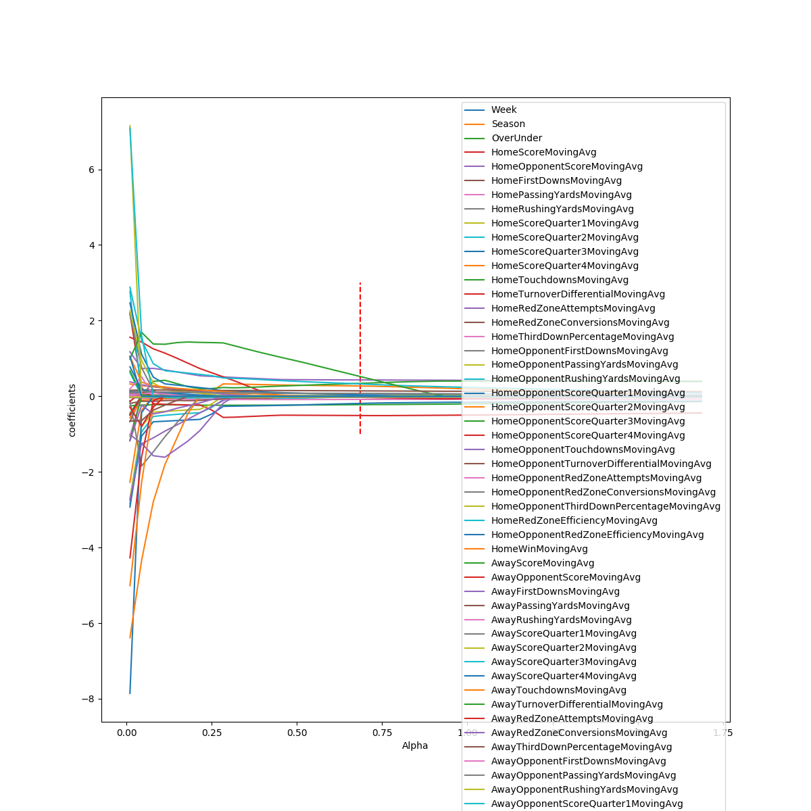

# Betting the Spread

### Background
Growing up in Denver, I religiously watched the Broncos with my dad every Sunday. Throughout my years as a Bronco fan, there have been a lot of ups and downs - namely Super Bowl 48 and Super 50 - but if one thing has stayed consistent, it is my dad yelling at the tv that the Broncos never beat the spread. However, since 2012, the Broncos have beaten the spread in 51% of the games they played.


But if I had to guess whether or not the Broncos cover the spread this weekend again the undefeated Los Angles Rams, I would guess that they don't.


My dad's faithful criticism of the Broncos inspired me to try and build a model to predict whether an NFL team beat the spread or not. For the scope of the project, I am only looking at Regular Season NFL Games from 2012 to 2018.


### The Data

<!-- https://developer.fantasydata.com/docs/services/57a0190935491a1858749954/operations/58137f1c35491a1520575141/console -->
<!-- http://www.vegasinsider.com -->

The game data for this project came from the Fantasy Data API, which had 242 individual features for every game. From the available attributes, I selected 35 that I thought most contributed to predicting the spread. Passing Yards, Rushing Yards, Touchdowns, and Turnover Differential were among some of the features I selected.

Additionally, I wrote a web scrapper using BeautifulSoup to gather the closing odds set by every casino from Vegas Insiders for each NFL game over the past several years. My plan was to merge the data from Vegas Insider with the NFL game statistics. However, after analyzing the data, I wasn't able to efficiently combine the Vegas Insider data with the statistics from the Fantasy Data API since the key values were not consistent.

### EDA

When I first approached this problem, I wanted to see if certain teams covered the spread more consistently than others.  The bar chart below outlines the percentage of games that each team covered the spread since 2012. As you can notice, teams like the Minnesota Vikings, Cinncinati Bengals, and the New England Patriots cover the spread around 60% of the time, while other teams like the Baltimore Ravens, Cleveland Browns, and the Tennessee Titans only beat the spread less 44% of the time.

 </br>

Next, I wanted to see if there was any relationship between the average spread of the home team's previous game and the actual spread for the game. I also created a graph to illustrate the same relationship for the opposing team.

 

Unfortunately, the average spreads for the previous games for both the home team and the away team don't have much predictive power for the actual spread, but I made a cool 3D spinning graph to further emphasis this point.

 

### Feature Selection
The game statistics came from the Fantasy Data API, which had 242 individual features from each game. From the available attributes, I selected the 35 which I thought would be most predictive of the actual spread. Passing yards, rushing yards, third-down efficiency, and scoring statistics were among some of the features I initially selected from the API.

Once I gathered and cleaned the data, I calculated a rolling average for each of the quantitative features over the previous 5 games for each team. I then combined the rolling averages with the NFL schedule and spread information to create my final dataset.

```
    # calculate moving averages for each team
    for team in teams:
        for col in columns:
            team["{}MovingAvg".format(col)] = team[col].shift(1).rolling(WINDOW).mean()
```

After I had my dataset with the moving averages




| Feature| Coefficients|
|--------|-------|
|HomeOpponentScoreMovingAvg | 0.133 |
|HomeScoreMovingAvg |-0.095 |
|AwayScoreMovingAvg| 0.074|
|AwayTurnoverDifferentialMovingAvg| 0.055|
|AwayScoreQuarter3MovingAvg|0.053|
|HomeFirstDownsMovingAvg|-0.044|
|OverUnder|-0.042|
|HomeScoreQuarter2MovingAvg|-0.037|
|HomeScoreQuarter3MovingAvg|-0.036|
|AwayThirdDownPercentageMovingAvg|0.035|
|HomeRedZoneAttemptsMovingAvg|-0.029|
|AwayOpponentRedZoneAttemptsMovingAvg|-0.029|
|AwayOpponentRedZoneEfficiencyMovingAvg|0.027|
|AwayOpponentScoreMovingAvg|-0.023|
|AwayOpponentTouchdownsMovingAvg|-0.019|
|omeOpponentScoreQuarter2MovingAvg|0.018|
|AwayScoreQuarter2MovingAvg|0.016|


### Modeling the Difficulty of a Climb

### Improving the Grade Model?

### Modeling How Hard Users Climbed in 2017

### Results - Why are these models not performing well?

### Future Work

### References
